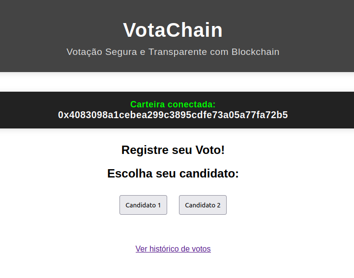
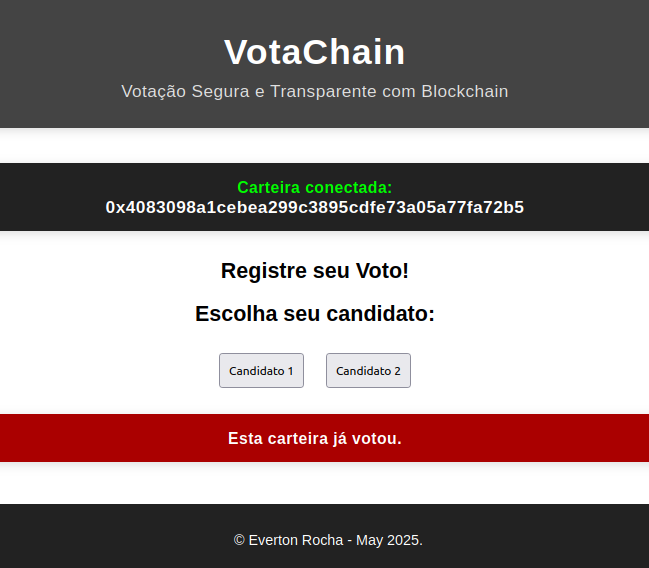
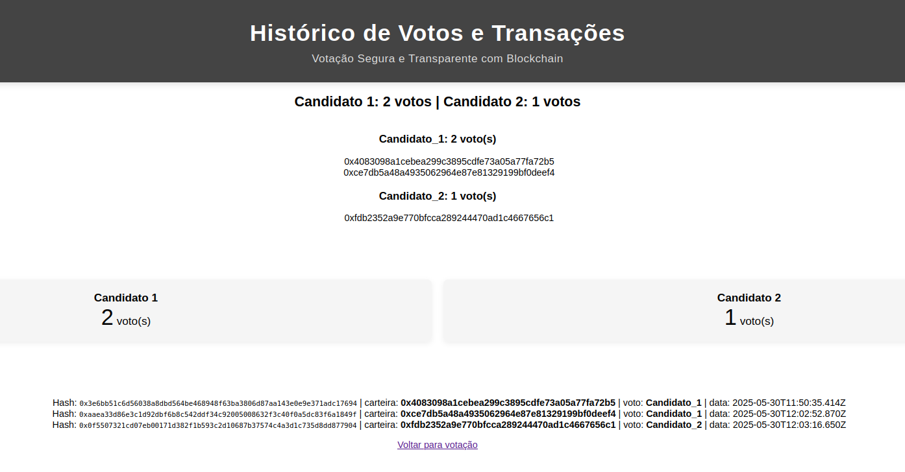

# Votachain
Projeto de finalização da Pós Graduação em WEB3.0 pela faculdade Descomplica.<br>
VotaChain é um projeto que simula a utilização da tecnologia blockchain para criação de um sistema de votação digital transparente e seguro.<br>
O projeto permite que usuários votem de qualquer lugar usando carteiras digitais ex. MetaMask via navegador web.<br>


---

## Funcionalidades

- **Votação segura:** Cada voto é autenticado via MetaMask e registrado como uma transação na blockchain local (Ganache).
- **Transparência:** Todos os votos e transações podem ser auditados na página de histórico.
- **Prevenção de votos duplicados:** Cada carteira pode votar apenas uma vez.
- **Frontend responsivo:** Interface clara, com destaque para a carteira conectada e mensagens de status.
- **Ambiente Docker:** Fácil de rodar em qualquer ambiente com Docker.

---

## Estrutura do Projeto

- Blockchain - (Ethereum/Ganache).
- Backend - (Node.js/Express).
- Frontend - Interface web estática (HTML/CSS/JS).
```
votachain/
├── backend/         # API Node.js/Express + Web3
│   ├── Dockerfile
│   ├── package.json
│   └── server.js
├── frontend/        # Interface web estática (HTML/CSS/JS)
│   ├── Dockerfile
│   ├── index.html
│   ├── historico.html
│   ├── script.js
│   └── style.css
├── docker-compose.yml
```

---

## Pré-requisitos

- [Docker](https://www.docker.com/)
- [MetaMask](https://metamask.io/)

---

## Como rodar o projeto

1. **Clone o repositório:**

   ```bash
   git clone https://github.com/RochaEverton/VotaChain.git
   cd votachain
   ```

2. **Suba os containers com Docker Compose:**

   ```bash
   docker-compose up --build
   ```

   Isso irá iniciar:
   - **Ganache** (blockchain local) na porta 8545
   - **Backend** (Node.js/Express) na porta 3000
   - **Frontend** (Nginx) na porta 8080

3. **Acesse a aplicação:**

   Abra [http://localhost:8080](http://localhost:8080) no navegador.

4. **Conecte sua MetaMask:**

   - Configure a MetaMask para usar a rede local Ganache:
     - RPC: `http://localhost:8545`
     - Chain ID: `1337` (ou `5777`, dependendo do Ganache)
   - Importe uma das contas exibidas pelo Ganache (veja logs do container Ganache para as chaves privadas).

5. **Vote:**

   - Escolha um candidato e vote. Será solicitado que você assine a mensagem via MetaMask.
   - Cada carteira pode votar apenas uma vez.

6. **Veja o histórico:**

   - Clique em "Ver histórico de votos" para ver a apuração, as carteiras que votaram e as transações registradas.

---

## Observações

- **Ambiente de testes:** O projeto usa Ganache, uma blockchain local para desenvolvimento. Não utilize para produção.
- **Persistência:** Os votos e transações são mantidos em memória no backend. Ao reiniciar o backend, os dados são perdidos.
- **Segurança:** O backend valida a assinatura de cada voto, garantindo que apenas o dono da carteira pode votar.
- **Personalização:** Para adicionar mais candidatos, ajuste o frontend e backend conforme necessário.

---

## Tecnologias utilizadas

- Node.js, Express, Web3.js.
- Ganache (Ethereum local).
- MetaMask.
- HTML, CSS, JavaScript.
- Docker, Docker Compose.
- Nginx (para servir o frontend).

---

## Screenshots
<p align="center">
  
   
</p>

<p align="center">
  
   
</p>


---

## Licença

MIT

---

**Desenvolvido por Everton Rocha – Maio/2025**
